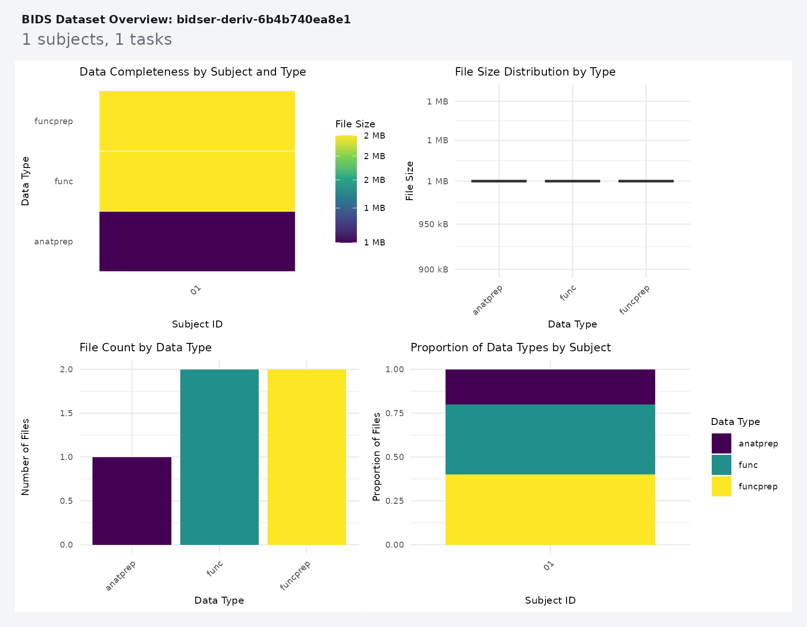
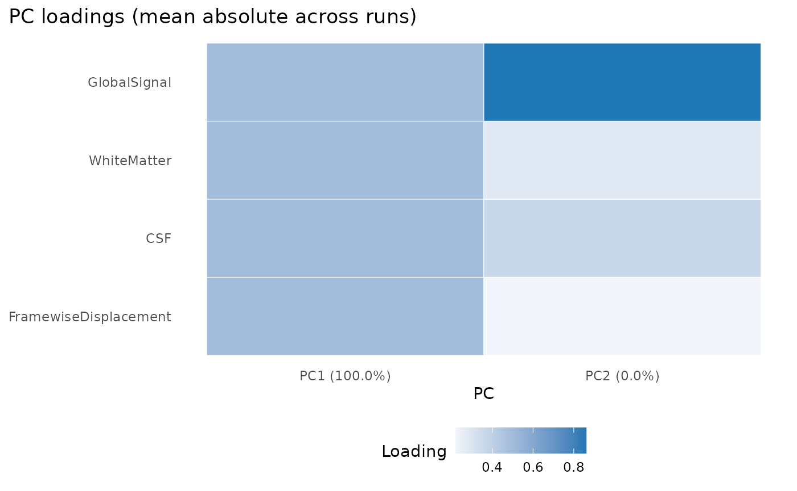

# Work With Derivatives and Confounds

When a BIDS project already has derivatives, the first job is usually
not data loading. It is figuring out which pipeline produced which
files, whether the expected confounds are present, and whether each run
is analysis-ready.

This vignette uses a tiny local project so the full workflow is runnable
without downloading example data. For raw-project discovery, start with
[`vignette("quickstart")`](https://bbuchsbaum.github.io/bidser/articles/quickstart.md).

## Where are the derivatives?

Use
[`plot_bids()`](https://bbuchsbaum.github.io/bidser/reference/plot_bids.md)
to get a fast overview of the raw project plus attached derivative
folders.

``` r
plot_bids(proj, interactive = FALSE)
```



For code,
[`derivative_pipelines()`](https://bbuchsbaum.github.io/bidser/reference/derivative_pipelines.md)
is the clearest inspection entry point.

``` r
pipes <- derivative_pipelines(proj)
pipes
#> # A tibble: 2 × 4
#>   pipeline root                 description source    
#>   <chr>    <chr>                <list>      <chr>     
#> 1 fmriprep derivatives/fmriprep <bds_dts_>  discovered
#> 2 qsiprep  derivatives/qsiprep  <bds_dts_>  discovered

stopifnot(
  nrow(pipes) == 2L,
  all(c("fmriprep", "qsiprep") %in% pipes$pipeline)
)
```

The fixture has two derivative roots, but only one of them contains
functional preprocessed BOLD data. That is the pipeline you want to
target in the next query.

## How do you pull one derivative run?

Use
[`query_files()`](https://bbuchsbaum.github.io/bidser/reference/query_files.md)
when you want explicit scope and pipeline control.

``` r
prep_bold <- query_files(
  proj,
  regex = "bold\\.nii\\.gz$",
  scope = "derivatives",
  pipeline = "fmriprep",
  desc = "preproc",
  return = "tibble"
)

prep_bold[, c("path", "scope", "pipeline")]
#> # A tibble: 1 × 3
#>   path                                                            scope pipeline
#>   <chr>                                                           <chr> <chr>   
#> 1 derivatives/fmriprep/sub-01/func/sub-01_task-rest_run-01_space… deri… fmriprep

stopifnot(
  nrow(prep_bold) == 1L,
  identical(prep_bold$scope[[1]], "derivatives"),
  identical(prep_bold$pipeline[[1]], "fmriprep")
)
```

That query stays readable because each filter answers one question:
which file suffix, which scope, and which pipeline.

## How do you read and check confounds?

[`read_confounds()`](https://bbuchsbaum.github.io/bidser/reference/read_confounds.md)
reads the derivative table and returns a tibble that stays indexed by
subject, task, run, and session.

``` r
confounds_flat <- read_confounds(
  proj,
  subid = "01",
  task = "rest",
  nest = FALSE
)

confounds_flat
#> # A tibble: 4 × 8
#>     CSF WhiteMatter GlobalSignal FramewiseDisplacement participant_id task 
#>   <dbl>       <dbl>        <dbl>                 <dbl> <chr>          <chr>
#> 1   0.1         0.4          1                    0.01 01             rest 
#> 2   0.2         0.5          1.1                  0.02 01             rest 
#> 3   0.3         0.6          1.2                  0.03 01             rest 
#> 4   0.2         0.5          1.1                  0.02 01             rest 
#> # ℹ 2 more variables: run <chr>, session <chr>

stopifnot(
  nrow(confounds_flat) == 4L,
  all(is.finite(confounds_flat$FramewiseDisplacement)),
  max(confounds_flat$FramewiseDisplacement) < 0.05
)
```

If you want a compact diagnostic view, ask for principal components and
plot them.

``` r
confounds_pca <- read_confounds(
  proj,
  subid = "01",
  task = "rest",
  npcs = 2
)

plot(confounds_pca, view = "aggregate")
```



The plot is most useful as a quick failure check: if the confounds are
missing, degenerate, or wildly scaled, the PCA summary becomes obviously
suspicious.

## How do you verify run-level coverage?

[`variables_table()`](https://bbuchsbaum.github.io/bidser/reference/variables_table.md)
pulls scans, events, and confounds into one run-level tibble without
forcing you to manage separate joins.

``` r
run_variables <- variables_table(
  proj,
  scope = "all",
  pipeline = "fmriprep"
)

run_variables[, c(".subid", ".task", ".run", "n_scans", "n_events", "n_confound_rows")]
#> # A tibble: 1 × 6
#>   .subid .task .run  n_scans n_events n_confound_rows
#>   <chr>  <chr> <chr>   <int>    <int>           <int>
#> 1 01     rest  01          1        1               4

stopifnot(
  run_variables$n_scans[[1]] == 1L,
  run_variables$n_events[[1]] == 1L,
  run_variables$n_confound_rows[[1]] == 4L
)
```

That table is a practical checkpoint before model fitting because it
shows whether each run has the pieces you expect.

## How do you turn that into a report?

[`bids_report()`](https://bbuchsbaum.github.io/bidser/reference/bids_report.md)
wraps the same run-level coverage into a compact text report.

``` r
report <- bids_report(
  proj,
  scope = "all",
  pipeline = "fmriprep"
)

report
#> BIDS Report
#> Project: bidser-deriv-6b4b740ea8e1 
#> Participants source: file 
#> Subjects: 1 
#> Sessions: 0 
#> Tasks: rest 
#> Total runs: 1 
#> Compliance: passed 
#> Index: available 
#> Pipelines: fmriprep, qsiprep 
#> Indexed runs: 1
```

## Next Steps

Use
[`vignette("quickstart")`](https://bbuchsbaum.github.io/bidser/articles/quickstart.md)
for raw BIDS inspection and
[`vignette("mock-bids")`](https://bbuchsbaum.github.io/bidser/articles/mock-bids.md)
when you need a fully local project for tests, demos, or packaging
workflows.
