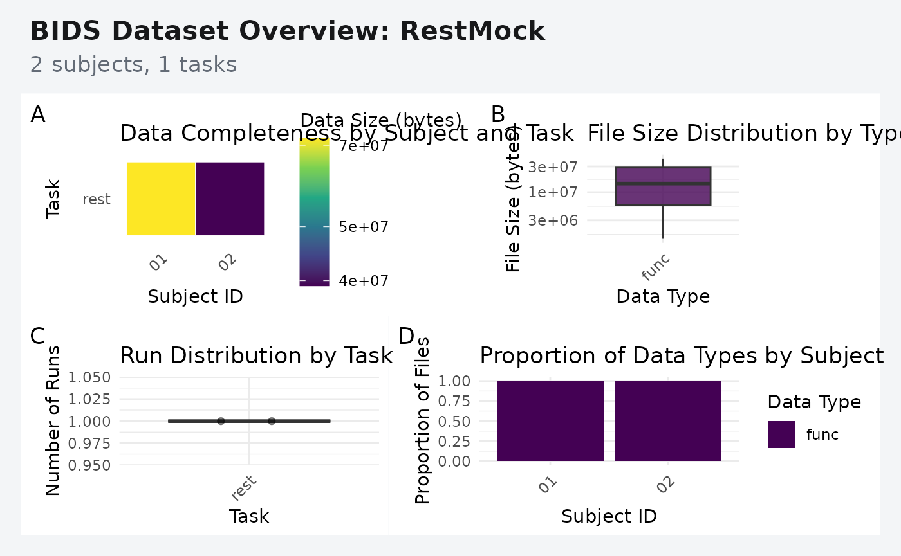

# Create Mock BIDS Projects for Tests and Examples

If you are writing tests, teaching examples, or demonstrating archive
workflows, you usually do not want a downloaded dataset. You want a tiny
BIDS project that lives on disk, has predictable contents, and can
include both raw and derivative files.

[`create_mock_bids()`](https://bbuchsbaum.github.io/bidser/reference/create_mock_bids.md)
is the entry point for that job.

## What does a small mock project look like?

Start by defining participants and a file inventory.

``` r
participants <- tibble(
  participant_id = c("01", "02")
)

file_structure <- tribble(
  ~subid, ~datatype, ~task, ~run, ~suffix, ~fmriprep,
  "01", "func", "rest", "01", "bold.nii.gz", FALSE,
  "01", "func", "rest", "01", "events.tsv", FALSE,
  "01", "func", "rest", "01", "bold.nii.gz", TRUE,
  "01", "func", "rest", "01", "desc-confounds_timeseries.tsv", TRUE,
  "02", "func", "rest", "01", "bold.nii.gz", FALSE,
  "02", "func", "rest", "01", "events.tsv", FALSE
)
```

Now add the tabular payloads you want written into event and confound
files.

``` r
event_data <- list(
  "sub-01/func/sub-01_task-rest_run-01_events.tsv" = tibble(
    onset = c(0, 12),
    duration = c(1, 1),
    trial_type = c("cue", "target")
  ),
  "sub-02/func/sub-02_task-rest_run-01_events.tsv" = tibble(
    onset = c(0, 10),
    duration = c(1, 1),
    trial_type = c("cue", "target")
  )
)

confound_data <- list(
  "derivatives/mockprep/sub-01/func/sub-01_task-rest_run-01_desc-confounds_timeseries.tsv" = tibble(
    CSF = c(0.10, 0.20, 0.30, 0.20),
    WhiteMatter = c(0.30, 0.40, 0.50, 0.40),
    GlobalSignal = c(1.00, 1.10, 1.20, 1.10),
    FramewiseDisplacement = c(0.01, 0.02, 0.03, 0.02)
  )
)
```

Create the project on disk so you can query it and archive it later.

``` r
mock_dir <- tempfile("bidser-mock-")

mock_proj <- create_mock_bids(
  project_name = "RestMock",
  participants = participants,
  file_structure = file_structure,
  event_data = event_data,
  confound_data = confound_data,
  create_stub = TRUE,
  stub_path = mock_dir,
  prep_dir = "derivatives/mockprep"
)

mock_proj
#> Mock BIDS Project Summary 
#> Project Name:  RestMock 
#> Participants (n):  2 
#> Tasks:  rest 
#> Derivatives:  derivatives/mockprep 
#> Datatypes:  func 
#> Suffixes:  nii.gz, tsv 
#> BIDS Keys:  (none) 
#> Path:  /tmp/Rtmp3nrj1l/bidser-mock-5b1d1bf71553

stopifnot(file.exists(file.path(mock_dir, "participants.tsv")))
```

You can inspect the resulting layout immediately with
[`plot_bids()`](https://bbuchsbaum.github.io/bidser/reference/plot_bids.md).

``` r
plot_bids(mock_proj, interactive = FALSE)
```



## How do you query raw and derivative files?

Because
[`query_files()`](https://bbuchsbaum.github.io/bidser/reference/query_files.md)
works on mock projects too, you can test selection logic before you
point the same code at a real dataset.

``` r
raw_runs <- query_files(
  mock_proj,
  regex = "bold\\.nii\\.gz$",
  scope = "raw",
  return = "tibble"
)

derivative_runs <- query_files(
  mock_proj,
  regex = "bold\\.nii\\.gz$",
  scope = "derivatives",
  return = "tibble"
)

raw_runs[, c("path", "scope")]
#> # A tibble: 2 × 2
#>   path                                            scope
#>   <chr>                                           <chr>
#> 1 sub-01/func/sub-01_task-rest_run-01_bold.nii.gz raw  
#> 2 sub-02/func/sub-02_task-rest_run-01_bold.nii.gz raw
derivative_runs[, c("path", "scope", "pipeline")]
#> # A tibble: 1 × 3
#>   path                                                            scope pipeline
#>   <chr>                                                           <chr> <chr>   
#> 1 derivatives/mockprep/sub-01/func/sub-01_task-rest_run-01_bold.… deri… fmriprep

stopifnot(
  nrow(raw_runs) == 2L,
  nrow(derivative_runs) == 1L
)
```

## How do you inspect injected events and confounds?

The mock project stores real tabular data, so the higher-level readers
work the same way they do on a real project.

``` r
subject_events <- read_events(mock_proj, subid = "01") %>%
  unnest(cols = data)

subject_events
#> # A tibble: 2 × 7
#> # Groups:   .subid, .task, .run, .session [1]
#>   .subid .task .run  .session onset duration trial_type
#>   <chr>  <chr> <chr> <chr>    <dbl>    <dbl> <chr>     
#> 1 01     rest  01    NA           0        1 cue       
#> 2 01     rest  01    NA          12        1 target

stopifnot(
  nrow(subject_events) == 2L,
  all(subject_events$duration > 0)
)
```

``` r
mock_confounds <- read_confounds(
  mock_proj,
  subid = "01",
  nest = FALSE
)

mock_confounds
#> # A tibble: 4 × 9
#>   .subid .task .run  .session .desc       CSF WhiteMatter GlobalSignal
#>   <chr>  <chr> <chr> <chr>    <chr>     <dbl>       <dbl>        <dbl>
#> 1 01     rest  01    NA       confounds   0.1         0.3          1  
#> 2 01     rest  01    NA       confounds   0.2         0.4          1.1
#> 3 01     rest  01    NA       confounds   0.3         0.5          1.2
#> 4 01     rest  01    NA       confounds   0.2         0.4          1.1
#> # ℹ 1 more variable: FramewiseDisplacement <dbl>

stopifnot(
  nrow(mock_confounds) == 4L,
  all(is.finite(mock_confounds$GlobalSignal)),
  max(mock_confounds$FramewiseDisplacement) < 0.05
)
```

That makes mock projects useful for both file-level tests and downstream
table checks.

## How do you pack the project for sharing?

[`pack_bids()`](https://bbuchsbaum.github.io/bidser/reference/pack_bids.md)
creates an archive while replacing imaging files with zero-byte stubs.
That keeps the layout and tabular metadata intact without shipping full
images.

``` r
archive_file <- tempfile(fileext = ".tar.gz")
packed <- pack_bids(mock_proj, output_file = archive_file, verbose = FALSE)
archive_contents <- list_pack_bids(packed, verbose = FALSE)

archive_contents %>%
  select(file, type, is_stub) %>%
  head()
#>                                                                                              file
#> 1                                                               RestMock/dataset_description.json
#> 2                   RestMock/derivatives/mockprep/sub-01/func/sub-01_task-rest_run-01_bold.nii.gz
#> 3 RestMock/derivatives/mockprep/sub-01/func/sub-01_task-rest_run-01_desc-confounds_timeseries.tsv
#> 4                                                                       RestMock/participants.tsv
#> 5                                        RestMock/sub-01/func/sub-01_task-rest_run-01_bold.nii.gz
#> 6                                         RestMock/sub-01/func/sub-01_task-rest_run-01_events.tsv
#>           type is_stub
#> 1         json   FALSE
#> 2 imaging_stub    TRUE
#> 3          tsv   FALSE
#> 4          tsv   FALSE
#> 5 imaging_stub    TRUE
#> 6          tsv   FALSE

archive_contents %>%
  summarise(
    n_files = n(),
    n_stubs = sum(is_stub),
    n_tsv = sum(type == "tsv")
  )
#>   n_files n_stubs n_tsv
#> 1       8       3     4

stopifnot(
  file.exists(packed),
  any(archive_contents$is_stub)
)
```

## Next Steps

Use
[`vignette("quickstart")`](https://bbuchsbaum.github.io/bidser/articles/quickstart.md)
for reader-facing BIDS discovery and
[`vignette("derivatives")`](https://bbuchsbaum.github.io/bidser/articles/derivatives.md)
when you want to move from file inventories to pipeline-aware derivative
summaries.
